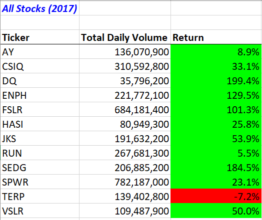
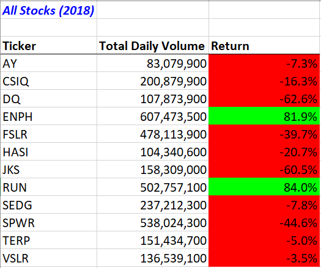
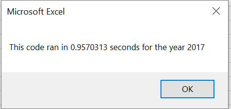
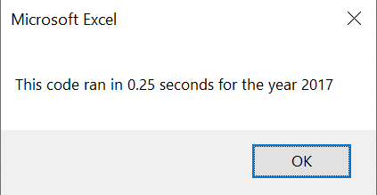
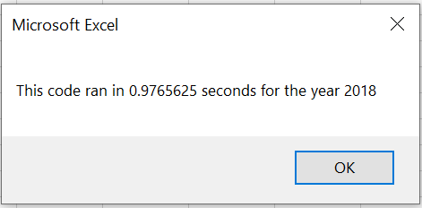
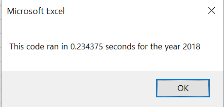

# Analysis of Stock from 2017 and 2018

## Overview of Project

### Purpose
The purpose of this project was to compare stock performance between the year 2017 and 2018, using refactored VBA script in Microsoft Excel. The goal was to determine if refactoring would increase the efficiency of the original VBA script.
 

## Results
### Stock Performance in 2017 and 2018

Table 1: All Stocks Data for 2017

 

Table 2: All Stocks Data for 2018

 

From the displayed data, it is apparent that majority of all the stocks performed better in 2017 than 2018. For example, in 2017, the return rate for DQ was 199.4%; however, in 2018, it performed at -62.6%. ENPH had a return rate of 129.5% in 2017 but did not perform as well in 2018 (81.9%). ENPH is the only stock that performed well in both years. 
 
 
For both 2017 and 2018, TERP would not have been a wise stock to invest in, performing at -7.2% and -5.0%, respectively. There was a slight improvement in return rates of TERP from 2017 to 2018.
 
 
RUN is the only stock that improved from one year to the other, increasing 78.5%.

### Analysis of VBA Code Runtime

Using the original VBA code to analyze stock data from 2017, the runtime 0.9570313 seconds.
 

 

The refactored code resulted in a runtime of 0.25 seconds.
 

 

Using the original VBA code to analyze stock data from 2018, the runtime 0.9765625 seconds. 
 

 
The refactored code resulted in a runtime of 0.234375 seconds.
 

 

Overall, the refactored VBA code proved to improve the efficiency of the original script by lowering the runtime of the stock analysis for both years.
 

## Summary

### Advantages and Disadvantages of Recfactoring Code
 
Refactoring code is a valuable tool in programming, used to string together a sequence of steps within a script to improve the efficiency of executing the code. An advantage of refactoring is that it makes code more readable. If a programmer followed my refactored work, it would be structured in a way that is easier to understand. The original code could work well, but its structure could be difficult for others to understand. Refactoring code could help make a project for another programmer easier in the future by better communicating its purpose (Fowler, 2018).
 
 
Another advantage of refactoring is that it helps developers find bugs by forcing them to take a closer look at their code as they work through it. Refactoring also speeds up the time it takes for a program to execute a script.
 
 
Although refactoring can help subsequent programmers speed up their work, refactoring may not be time-efficient for the original author of the code. It requires a great deal of effort from the author but results in less effort from those who follow. Another disadvantage is altering another person’s code could cause issues with code ownership. If code is owned by a different team, one may not have access to their repository; or altering that code could result in breaking clients (Fowler, 2018).
 
Refactoring can also lead to errors in the code. The point of refactoring is to make code more efficient while getting the same result. A break in the code could alter the end result, leading to more troubleshooting for the author.
 
 

### Advantages and Disadvantages of Original and Refactored VBA Script
 

